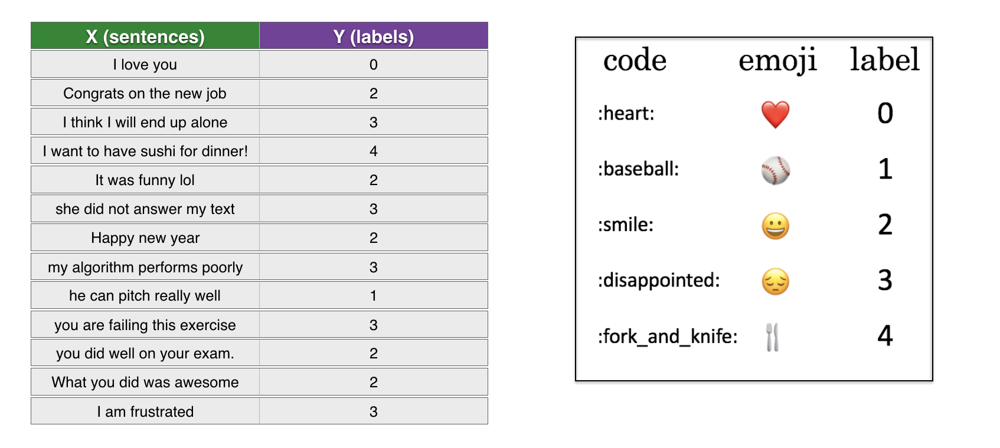

# Emojify
An Emojifier using LSTM. For example, inputting a sentence such as "Let's go see the baseball game tonight!" will find the most appropriate emoji to be used with this sentence (⚾).
Another example:
>"Congratulations on the promotion! Let's get coffee and talk. Love you!"   

The emojifier can automatically turn this into:
>"Congratulations on the promotion! 👍 Let's get coffee and talk. ☕️ Love you! ❤️"

# Model Overview
The LSTM model that takes word sequences as input!
* This model will be able to account for the word ordering. 
* Pre-trained word embeddings are fed into an LSTM.
* The LSTM will learn to predict the most appropriate emoji.

A pre-trained Embedded layer output is fed into the LSTM network. The word embeddings are obtained from [GloVe 50-dimensional vectors](/data/glove.6B.50d.txt.zip)
* The model takes as input an array of sentences of shape (`m`, `max_len`, ) defined by `input_shape`. Here 'm' is the number of training examples and 'max_len' is the number of words in a sentence in the dataset 
* The model outputs a softmax probability vector of shape (`m`, `C = 5`). 

The dataset (X, Y):
- X contains 127 sentences (strings).
- Y contains an integer label between 0 and 4 corresponding to an emoji for each sentence.

# Results
Expected emoji:😄 prediction: she got me a nice present	❤️

Expected emoji:😞 prediction: work is hard	😄

Expected emoji:😞 prediction: This girl is messing with me	❤️

Expected emoji:😞 prediction: work is horrible	😄

Expected emoji:🍴 prediction: any suggestions for dinner	😄

Expected emoji:❤️ prediction: I love taking breaks	😞

Expected emoji:😄 prediction: you brighten my day	❤️

Expected emoji:😞 prediction: she is a bully	❤️

Expected emoji:😄 prediction: will you be my valentine	❤️

Expected emoji:❤️ prediction: I love you to the stars and back	😄

Expected emoji:😄 prediction: What you did was awesome	😞

Test accuracy =  80.35%
Not Bad! Can be improved with more training examples

# References
 - [Woebot](http://woebot.io)
 - Sequence Models, Deep learning Specialization by Deeplearning.AI : https://www.coursera.org/learn/nlp-sequence-models
